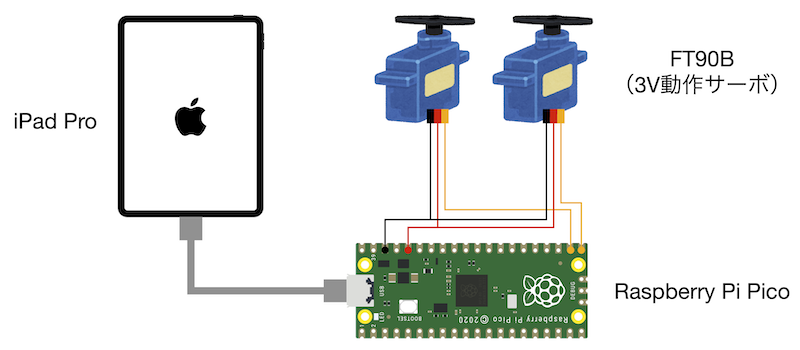

# MIDI-Servo-Control
MIDIメッセージでサーボを制御できるUSB MIDIデバイスと操作アプリのプロジェクト

## システム構成

## ファイル構成
ファイル名 | 説明
---|---
CircuitPython/code.py | USB MIDIデバイス側の制御プログラム。[CircuitPython](https://circuitpython.org)用
MIDI Servo Control.swiftpm | iPad側のアプリプロジェクト。[Swift Playgrounds](https://www.apple.com/jp/swift/playgrounds/)用

## CircuitPythonと制御プログラムのインストール
あとで
